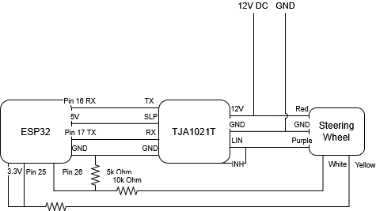

# Cupra Steering Wheel Gamepad 🎮

I was inspired by Funny_Procedure_7609 on Reddit's conversion of a Porsche Steering Wheel and decided that I can't be that hard to make all to Buttons work. One Month later I have a working Steering Wheel with all Buttons converted on an ESP32 working over Bluetooth. I am using the BLE Libary for Ardunino for connecting to Windows. If you buy an Arduino ESP32-S3 or some other board that has HID communication directly integrated you can also use a wired connection. Currently I am working on finalzing everything and fitting it.

Huge thanks to the Community over at [vwidtalk.com](https://www.vwidtalk.com/threads/i-have-real-steering-wheel-buttons.18466/page-8) and specifically JohnnyForElectric who posted his ID 4 LIN communication snippets. With out this file the Project would have taken way longer.

## Features

*   **Steering Wheel Integration**
    *   Reads button states from Volkswagen steering wheels with LIN bus communication, including models from VW, Audi, Skoda, and Seat (tested with a Cupra Formentor/Leon steering wheel, compatibility with other VAG models is very likely but not guaranteed).
    *   All Buttons work!
*   **Bluetooth Capabilities**
    *   Transmits button presses wirelessly as a standard Bluetooth gamepad, compatible with PCs and other Bluetooth-enabled devices.
    *   Utilizes Bluetooth Low Energy (BLE) for efficient power consumption.
*   **Backlight Control**
    *   Provides 128 levels of brightness control for the steering wheel buttons' backlight.

## How It Works

This project utilizes the LIN bus, a communication network in vehicles, to read button presses from the steering wheel. The ESP32 microcontroller acts as the master node on the LIN bus, requesting and receiving data from the steering wheel (the slave node).

1.  **Button Press:** When you press a button on the steering wheel, the steering wheel module sends a data packet over the LIN bus.
2.  **ESP32 Reads Data:** The ESP32, connected to the LIN bus via the LIN transceiver, receives and decodes this data packet.
3.  **BLE Transmission:** The ESP32 translates the button press into a standard gamepad event and transmits it over BLE.
4.  **Game Action:** The receiving device (e.g., PC) recognizes the gamepad event and triggers the corresponding action in the game or application.

## Parts Used

| Part                    | Description                                                                     | Part Number |
|-------------------------|---------------------------------------------------------------------------------|-------------|
| Steering Wheel          | Top Spec Cupra Steering Wheel                                                | 5FA 419 091 FK XEY |
| LIN Transceiver         | TJA1020, TJA1021, or SIT1021T (I used a cheap TJA1021T from Aliexpress       | -                  |
| ESP32                   | Any ESP32 development board                                                  | -                  |
| 5V-12V Step-Up-Module   | Any 5V-12V will do if you plan on using USB-C                                | -                  |
| Tanleki Tiny Emulator   | For Fanatec at least you will need an Emulator for the force Feedback to work| [I used this one](https://de.aliexpress.com/item/1005007286369952.html?spm=a2g0o.order_list.order_list_main.11.62b55c5fwRTabe&gatewayAdapt=glo2deu)|
| Fanatec QR1 Wheelside   | Because I am using Fanatec your Wheelside may wary                           | -                  |
| Steering Column         | I used a steering column of a Steat Leon. Not sure if they are all the same  | 5WB 419 502 F      |
| Center Wheel Screw      | Center Screw since I am using OEM Parts to attach the Wheel                  | N90799102          |

## Buidling the Adapter

Please note that depending on your specific needs or constraints you may need to do things differently.

I went the OEM route because I think is cheaper than manufacturing everything from scratch. For the first step I cut the front most part of the steering wheel a bit behind the spline. Then I welded the piece to a steel plate. You have to make sure everything stays relativly lined up or your wheel will later be wobbly. 
On the backside opposite the column part I attached the wheelside adapter.

## Wiring Diagram

Please note that the wiring diagram is based on my specific setup. The wiring may be different depending on the steering wheel model or MCU board used.

## LIN Protocol

The Steering Wheel communicates over LIN at BAUD 19200 with 8 Databits and 1 Stopbit. Sync is typical 0x55 at 755 µs (LOW) with 112 µs (HIGH) Sync Delimiter.

The Bytes in this Table are all Databytes and the size is the Databyte size.

| Frame ID | Type             | Description                          | Size | Byte 0                                   | Byte 1                                  | Byte 2                                         | Byte 3                                         | Byte 6                                         |
|----------|------------------|--------------------------------------|------|------------------------------------------|-----------------------------------------|------------------------------------------------|------------------------------------------------|------------------------------------------------|
| 0x0D     | Master Request   | Set backlight level                  | 2    | 0x0 - 0x7F - Brightness level            | 0x9F - Enables/disables button state responses | -                                       | -                                              | -                                              |
| 0x0E     | Slave Response   | Button states Left Island & Paddles  | 8    | Increases on every response              | -                                       | Left button pressed (see mapping below)        | Left thumbwheel scroll direction               | Shift paddles (see mapping below)              |
| 0x0F     | Slave Response   | Button states Right Island           | 8    | Increases on every response              | -                                       | Right button pressed (see mapping below)       | -                                              | -                                              |
| 0x0C     | Master Response  | diagnostics data                     | 4    | Increases on every response              | -                                       | -                                              | -                                              | -                                              |
| 0x3A     | Slave Response   | diagnostics data                     | 2    | Increases on every response              | -                                       | -                                              | -                                              | -                                              |

**Button Mapping**

The Ignition and Cruise Control are physical wires.

| Wire color | Information                   | Button         |
|------------|-------------------------------|----------------|
| yellow     | ~ 200 Ohm when pressed        | Ignition       |
| white      | 12V! drops to 0V when pressed | Cruise Control |

| Frame ID + Byte | Hex  | Button          |
|-----------------|------|-----------------|
| 0x0E  Byte 2    | 0x12 | vol +           |
| 0x0E  Byte 2    | 0x12 | vol -           |
| 0x0E  Byte 2    | 0x20 | mute            |
| 0x0E  Byte 2    | 0x07 | ok              |
| 0x0E  Byte 2    | 0x06 | up              |
| 0x0E  Byte 2    | 0x06 | down            |
| 0x0E  Byte 2    | 0x02 | right           |
| 0x0E  Byte 2    | 0x03 | left            |
| 0x0E  Byte 2    | 0x15 | next            |
| 0x0E  Byte 2    | 0x16 | prev            |
| 0x0E  Byte 2    | 0x19 | voice           |
| 0x0E  Byte 2    | 0x23 | view            |
| 0x0E  Byte 2    | 0x25 | heat            |
| 0x0E  Byte 2    | 0x70 | cupra           |
| 0x0E  Byte 2    | 0x74 | lane assist     |
|-----------------|------|-----------------|
| 0x0E  Byte 6    | 0x01 | paddle -        |
| 0x0E  Byte 6    | 0x02 | paddle +        |
| 0x0E  Byte 6    | 0x03 | both paddles    |
|-----------------|------|-----------------|
| 0x0F  Byte 2    | 0x81 | set             |
| 0x0F  Byte 2    | 0x82 | +               |
| 0x0F  Byte 2    | 0x84 | -               |
| 0x0F  Byte 2    | 0x88 | res             |
| 0x0F  Byte 2    | 0xB0 | distance        |
